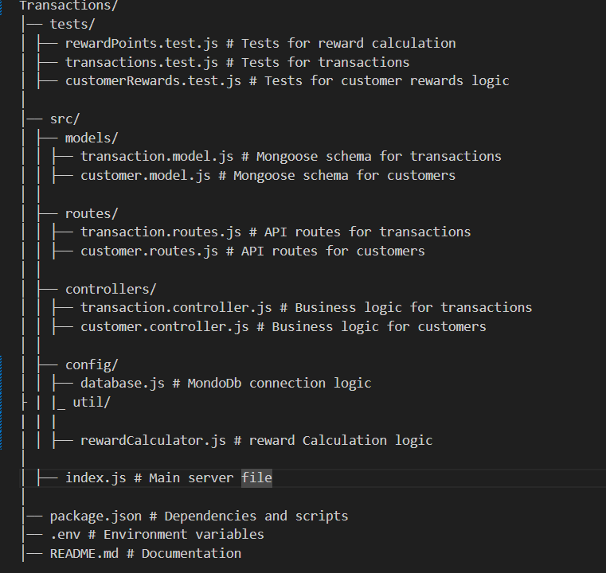
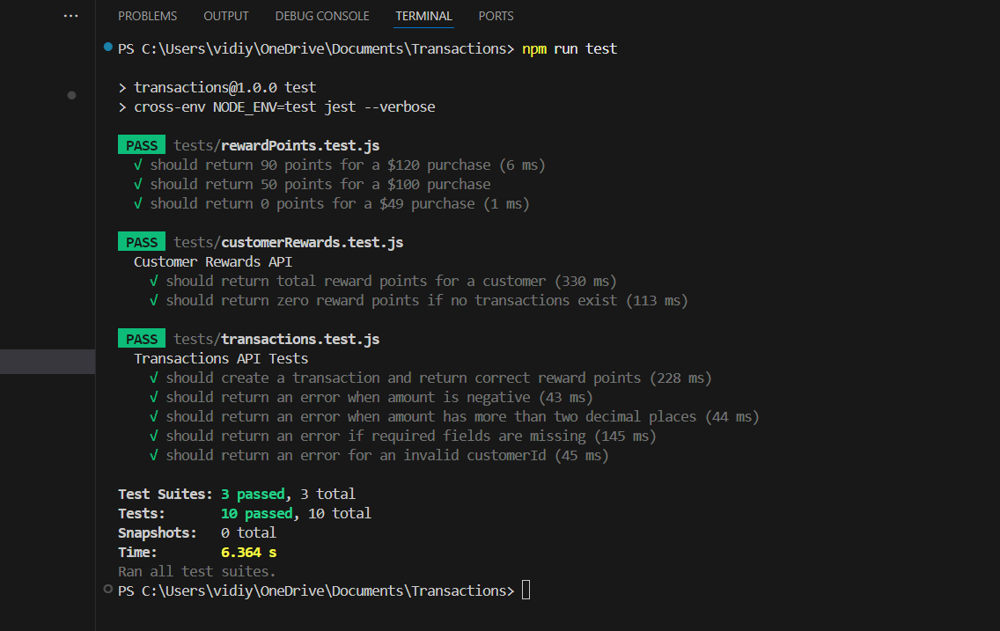
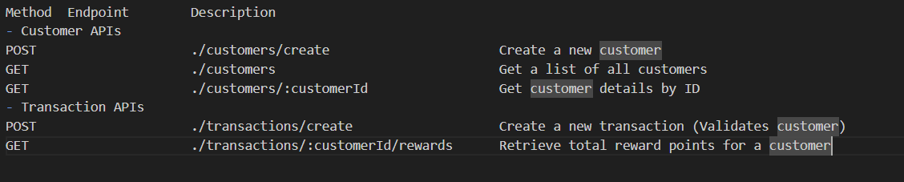

# Rewards Management System

### Project Overview

This project is a Transactions Management System built using Node.js, Express, and MongoDB. It allows users to manage transactions and calculate customer reward points efficiently. The application includes test cases to ensure the correctness of the implementation.

### Features

- Transaction Management: CRUD operations for transactions.
- Customer Rewards Calculation: Computes reward points based on transaction history.
- REST API: Implements RESTful API endpoints for interaction.
- Unit Testing: Uses Jest for automated testing.
- Database Indexing: Optimized queries with an index on customerId.
- Environment Configuration: Supports NODE_ENV for different environments.

### Project Structure

### Setup Instructions

# Prerequisites

- Node.js installed (version: v22.14.0)
- MongoDB instance running

### Installation

1️⃣ Clone the repository

`git clone https://github.com/vidiyaG/customers-rewards.git`

`cd Transactions`

2️⃣ Install dependencies
`npm install`

4️⃣ Start the application
`npm run start`

- The server will run on http://localhost:3000/

4️⃣ Start the application
`npm run test`

- Uses Jest and Supertest for unit and integration testing.
- Includes tests for transaction creation, reward calculation, and customer rewards API.

### Technologies Used

- Node.js – Backend framework.
- Express.js – Server framework.
- MongoDB & Mongoose – Database and ODM.
- Jest & Supertest – Unit and API testing.
- npm, git

### API end POINT

Method Endpoint Description

- Customer APIs
  
